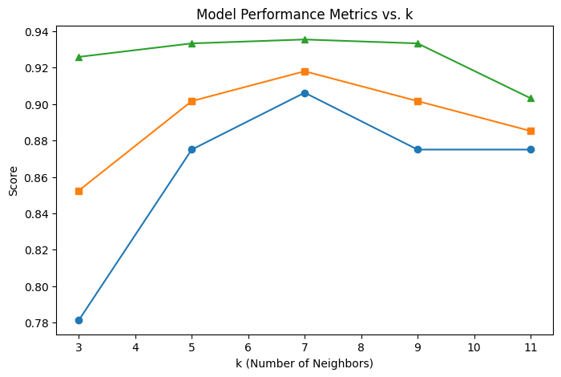

# ❤️ Heart Disease Classification using K-Nearest Neighbors (KNN


## 📌 Project Overview

Heart Disease Classification is a Machine Learning project that predicts the presence of heart disease using clinical patient data. The project utilizes the **K-Nearest Neighbors (KNN)** algorithm and evaluates multiple values of **K** to identify the optimal model configuration.

The workflow includes:

* Data loading and exploration
* Data preprocessing and normalization
* Model training using KNN
* Hyperparameter tuning
* Performance evaluation
* Visualization of Accuracy, Precision, and Recall

---

## 🎯 Objectives

* Build a classification model to predict heart disease.
* Compare multiple KNN configurations.
* Analyze the impact of different K values on model performance.
* Visualize evaluation metrics for model selection.
 
---

## 📂 Repository Structure

```text
Heart-Disease-Classification/
│
├── heart.csv              # Original heart disease dataset
├── score.csv              # Model evaluation results
├── metrics_plot.png       # Accuracy, Precision & Recall visualization
├── notebook.ipynb         # Complete ML workflow notebook
├── requirements.txt       # Project dependencies
└── README.md              # Project documentation
```

---

## 📊 Dataset Information

The dataset contains various clinical attributes used to determine whether a patient has heart disease.

### Features

| Feature  | Description                       |
| -------- | --------------------------------- |
| age      | Age of patient                    |
| sex      | Gender                            |
| cp       | Chest pain type                   |
| trestbps | Resting blood pressure            |
| chol     | Serum cholesterol                 |
| fbs      | Fasting blood sugar               |
| restecg  | Resting ECG results               |
| thalach  | Maximum heart rate achieved       |
| exang    | Exercise-induced angina           |
| oldpeak  | ST depression                     |
| slope    | Slope of peak exercise ST segment |
| ca       | Number of major vessels           |
| thal     | Thalassemia                       |
| target   | Heart Disease (0 = No, 1 = Yes)   |

---

## ⚙️ Machine Learning Workflow

### 1️⃣ Data Preprocessing

* Loaded dataset using Pandas
* Checked for missing values
* Separated features and target variable
* Split dataset into training and testing sets

### 2️⃣ Feature Scaling

KNN is distance-based, therefore feature scaling is essential.

```python
from sklearn.preprocessing import StandardScaler

scaler = StandardScaler()
X_train = scaler.fit_transform(X_train)
X_test = scaler.transform(X_test)
```

### 3️⃣ Model Training

The following K values were evaluated:

```text
K = 3
K = 5
K = 7
K = 9
K = 11
```

## 📈 KNN Performance Analysis

The graph below illustrates how the K-Nearest Neighbors classifier performs as the value of **K** changes.



### 🔍 Performance Insights

The KNN algorithm's performance varies significantly with the choice of **K**.

- **K = 3**
  - Highest Precision (~92.5%)
  - Lower Recall (~78.1%)
  - Indicates a stricter classifier that makes fewer positive predictions.

- **K = 5**
  - Better balance between Precision and Recall.
  - Reduction in overfitting compared to K=3.

- **K = 7**
  - Best overall performance.
  - Accuracy reaches approximately **91.8%**.
  - Recall improves to approximately **90.6%**.
  - Provides the most balanced prediction capability.

- **K = 9 and K = 11**
  - Metrics begin to stabilize.
  - Slight decrease in Accuracy.
  - Model becomes smoother but may miss local patterns.

### 📌 Conclusion

The experimental results demonstrate that choosing an appropriate value of **K** is critical for KNN performance.

For this dataset:

✅ **K = 7** achieved the best balance between Accuracy, Precision, and Recall, making it the optimal configuration for heart disease prediction.

Using:

```python
from sklearn.neighbors import KNeighborsClassifier
```

---

## 📈 Model Evaluation

The following metrics were used:

* Accuracy
* Precision
* Recall

### Performance Summary

| K Value | Accuracy       | Precision | Recall   |
| ------- | -------------- | --------- | -------- |
| 3       | ~88.5%         | ~92.5%    | ~78.1%   |
| 5       | Improved       | Improved  | Improved |
| 7       | ~91.8%         | High      | ~90.6%   |
| 9       | Slightly Lower | Stable    | Stable   |
| 11      | Slightly Lower | Stable    | Stable   |

### Best Model

✅ **K = 7**

This configuration achieved the best balance between:

* Accuracy
* Precision
* Recall

making it the optimal model for this dataset.

---

## 📉 Performance Visualization

The generated visualization compares model metrics across different K values.

### Metrics Plot

```text
metrics_plot.png
```

The graph helps identify:

* Underfitting regions
* Optimal K value
* Performance trends

---

## 🛠️ Technologies Used

### Programming Language

* Python 3.8+

### Libraries

* Pandas
* NumPy
* Matplotlib
* Scikit-Learn

  * StandardScaler
  * KNeighborsClassifier
  * Train-Test Split
  * Evaluation Metrics

---

## 🚀 Installation & Setup

### Clone Repository

```bash
git clone https://github.com/akashsuryawanshi04/Heart-Attack-Possibility-using-KNN.git
cd YOUR_REPOSITORY_NAME
```

---

### Create Virtual Environment

#### Windows

```bash
python -m venv venv
venv\Scripts\activate
```

#### Linux / Mac

```bash
python3 -m venv venv
source venv/bin/activate
```

---

### Install Dependencies

```bash
pip install -r requirements.txt
```

---

### Run Jupyter Notebook

```bash
jupyter notebook
```

Open:

```text
notebook.ipynb
```

and click **Run All** to reproduce the entire workflow.

---

## 📋 Requirements

Example `requirements.txt`

```text
pandas
numpy
matplotlib
scikit-learn
jupyter
```

Install all dependencies:

```bash
pip install -r requirements.txt
```

---

## 🔮 Future Improvements

* Compare KNN with:

  * Logistic Regression
  * Decision Tree
  * Random Forest
  * XGBoost

* Implement Cross Validation

* Perform Feature Selection

* Deploy as a Web Application

* Create an Interactive Dashboard

---

## 📚 Learning Outcomes

Through this project, the following concepts were implemented:

✔ Data Preprocessing

✔ Feature Scaling

✔ Train-Test Splitting

✔ KNN Classification

✔ Hyperparameter Tuning

✔ Performance Evaluation

✔ Data Visualization

✔ Machine Learning Workflow

---

## 👨‍💻 Author

**Akash Suryawanshi**

MCA Student | AI & Machine Learning Engineer

GitHub: https://github.com/akashsuryawanshi04

LinkedIn: https://linkedin.com/in/akashsuryawanshi04

---

## ⭐ Support

If you found this project helpful:

⭐ Star the repository

🍴 Fork the project

📢 Share it with others

---

## 📄 License

This project is licensed under the MIT License.

Feel free to use, modify, and distribute this project for educational and research purposes.
